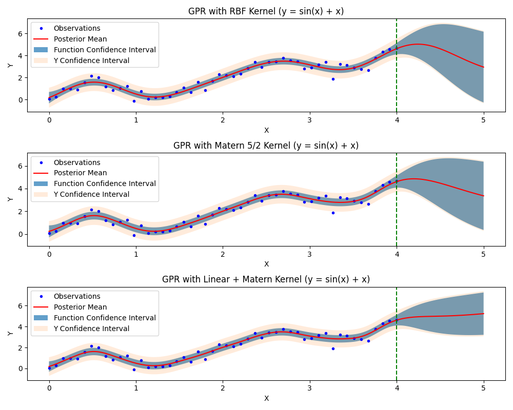
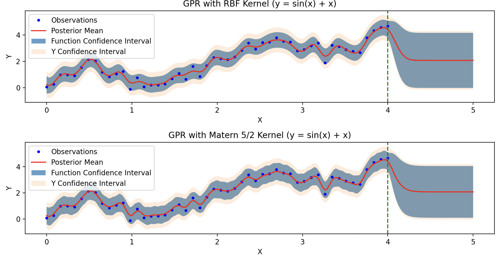

Tasks
https://docs.gpytorch.ai/en/stable/index.htm
Stage 0: Setup (DONE)

Create a repo.
Pick one GP library -> Chose GPyTorch

Stage 1: Basic GP regression implementation

GP regression on 1D function.
Implement experiments with at least 3 kernels (SE, Matern kernels).
For each kernel, fit hyperparameters, then compare the posterior mean and predictive variance.

Deliverables: 

Plot the mean function together with its uncertainty. 
 - Plot is under GP_Example_Plots. ( GP_Example_Plots/Stage1_Plots.png )

Discuss the effect of kernel smoothness.
 - matern 5/2 is twice differentiable, while Squared exponential is infinitely differentiable. It's hard to see a difference here as sine is infinitely differentiable, 
 - but we do see that final loss of Matern 5/2 is slightly higher, indicating worse performance. 
 
 Here, I cranked up rate, and we can see that the Matern is much noisier around the edges vs SE kernel.
 I also saw that final loss of Matern 5/2 was always worse than RBF with the same prior settings.

# Questions
 - is there a general good amount of training data to use? i notice with less data we get tight bounds, more data we get wider ones.
 - what is this? lengthscale_prior = gpytorch.priors.GammaPrior(3.0, 6.0) 
        outputscale_prior = gpytorch.priors.GammaPrior(2.0, 0.15) 

 - The predictive capability doesnt seem to see the upward bias, is this a kernel issue? how do you select the right composition of kernels in a complex unknown function?
 