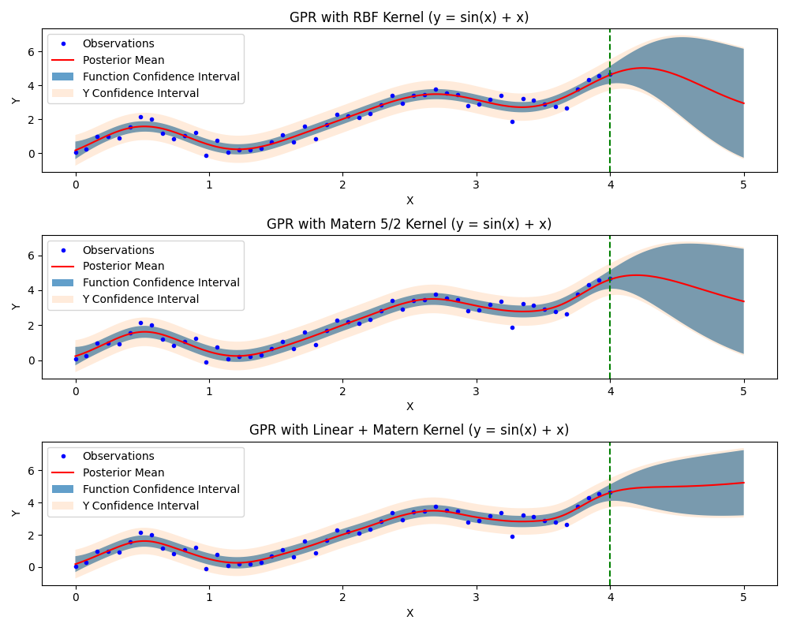
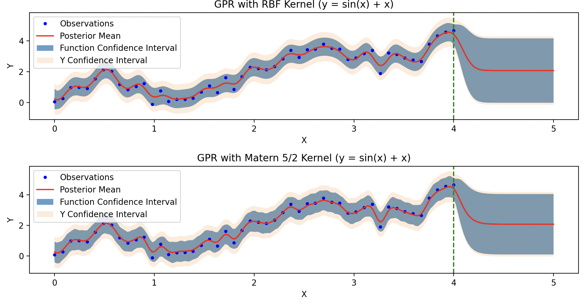

# Purpose:
Compare performance of conventional CBFs vs. CBFs learned via Gaussian Processes. 
Incorporate "smart polling" into learning-based GP-CBFs, intelligently selecting a next point to explore by choosing a nearby point of high covariance.

https://arxiv.org/pdf/2106.11899
# 4/05: Zero-noise CBF vs noisy CBF vs learned-CBF under varying simulated sensor noise conditions.

# 3/24: Conventional CBF performance under noise:

# Stage 4 (GIBO)

Locally "Trapped"

# Stage 1: Basic GP regression implementation (Done)
GP regression on 1D function.
Implement experiments with at least 3 kernels (SE, Matern kernels).
For each kernel, fit hyperparameters, then compare the posterior mean and predictive variance.

Deliverables: 
 - Plot is under GP_Example_Plots. ( GP_Example_Plots/Stage1_Plots.png ) 
 - We saw strongest performance from Linear + Matern (measured by lowest loss). This makes sense as the linear kernel accounts for the linear bias in our underlying function.

Discuss the effect of kernel smoothness.
 - matern 5/2 is twice differentiable, while Squared exponential is infinitely differentiable. In the image below, I cranked up the rate parameter of the initial linear scale. This shows that Matern 5/2 was much noisier around the edges as compared to the SE kernel. This seems to imply that infinitely differentiable kernels will have less noise and be more smooth.
 - Another Note: we do see that final loss of Matern 5/2 is slightly higher, indicating worse performance. 
 

# NOTES
 - GIBO tends to get Stuck in local regions. We can shift this by changing the step size that theta t+1 is updated by, but this seemed to be a recurring issue.

Stage 4:
 - interestingly, if we have more points at start we dont try to poll tghere

 
03/24 Deliverable
Safe navigation of robot with obstacles, (get familiar with signed distance functions)
 - implement learning cbf
 - compare performance with Azra's weighted acq funciton, gibo
